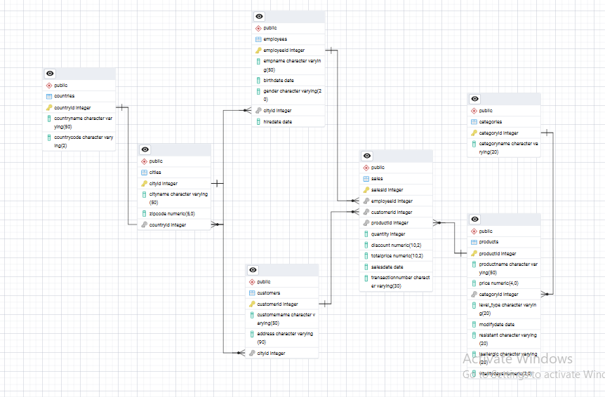

# Grocery_Sales_Data_Analysis_Project

## 📌 Project Overview

The **Grocery Sales Analysis** project is a data-driven exploration of a simulated retail environment using a structured relational database. It provides a four-month snapshot of sales transactions, customer demographics, product inventory, employee performance, and geographic distribution across multiple cities and countries.
This project is designed to help data analysts and aspiring data scientists practice real-world SQL querying, data cleaning, and insight extraction. The dataset is fully normalized and includes over 1,00,000 records, offering a rich and realistic foundation for business intelligence reporting and exploratory data analysis.

## 📁 Dataset Schema
A quick overview of each CSV file included in the dataset:

| File Name       | Description                                                  |
|------------------|--------------------------------------------------------------|
| `categories.csv` | Defines the categories of the products.                      |
| `cities.csv`     | Contains city-level geographic data.                         |
| `countries.csv`  | Stores country-related metadata.                             |
| `customers.csv`  | Contains information about the customers who make purchases. |
| `employees.csv`  | Stores details of employees handling sales transactions.     |
| `products.csv`   | Stores details about the products being sold.                |
| `sales.csv`      | Contains transactional data for each sale.                   |

Below is a breakdown of each CSV file used in the project along with the meaning of each column:

---

###  `sales.csv`
| Column Name        | Description                                                  |
|--------------------|--------------------------------------------------------------|
| SalesID            | Unique identifier for each sales transaction                 |
| EmployeeID         | Foreign key linking to the employee who handled the sale     |
| CustomerID         | Foreign key linking to the purchasing customer               |
| ProductID          | Foreign key linking to the product sold                      |
| Quantity           | Number of product units sold                                 |
| Discount           | Discount applied to the transaction (0–1 scale)              |
| TotalPrice         | Final price after discount (can be recalculated)             |
| SalesDate          | Date of the transaction                                      |
| TransactionNumber  | Unique alphanumeric transaction reference                    |

---

###  `products.csv`
| Column Name   | Description                                                       |
|---------------|-------------------------------------------------------------------|
| ProductID     | Unique identifier for each product                                |
| ProductName   | Name/description of the product                                   |
| Price         | Selling price of the product                                      |
| CategoryID    | Foreign key linking to the product category                       |
| Level_Type    | Quality level or classification of the product                   |
| ModifyDate    | Last modification date for the product entry                      |
| Resistant     | Durability classification (e.g., Durable, Weak)                   |
| IsAllergic    | Indicates if the product may cause allergies                      |
| VitalityDays  | Shelf life or freshness period in days                            |

---

###  `customers.csv`
| Column Name   | Description                                      |
|---------------|--------------------------------------------------|
| CustomerID    | Unique identifier for each customer              |
| CustomerName  | Full name of the customer                        |
| Address       | Street address of the customer                   |
| CityID        | Foreign key linking to the customer's city       |

---

###  `employees.csv`
| Column Name   | Description                                      |
|---------------|--------------------------------------------------|
| EmployeeID    | Unique identifier for each employee              |
| EmpName       | Employee’s full name                             |
| BirthDate     | Employee’s date of birth                         |
| Gender        | Gender of the employee (M/F)                     |
| CityID        | Foreign key linking to the employee's city       |
| HireDate      | Date the employee was hired                      |

---

###  `categories.csv`
| Column Name   | Description                                        |
|---------------|----------------------------------------------------|
| CategoryID    | Unique identifier for each product category        |
| CategoryName  | Name of the category (e.g., Dairy, Beverages)      |

---

###  `cities.csv`
| Column Name   | Description                                      |
|---------------|--------------------------------------------------|
| CityID        | Unique identifier for each city                  |
| CityName      | Name of the city                                 |
| Zipcode       | Postal code of the city                          |
| CountryID     | Foreign key linking to the country               |

---

###  `countries.csv`
| Column Name   | Description                                      |
|---------------|--------------------------------------------------|
| CountryID     | Unique identifier for each country               |
| CountryName   | Name of the country                              |
| CountryCode   | Abbreviated code for the country                 |

## Entity Relationship Diagram (ERD)

The following ERD illustrates the relationships between key entities in the Grocery Sales Database, including products, sales, customers, employees, and location data.

## Key Analytical Use Cases

This project enables data exploration across multiple business dimensions:

- ** Time-Based Analysis**
  - Track sales trends over the four-month period
  - Measure month-over-month performance
  - Identify seasonal peaks or dips

- ** Product Performance**
  - Determine top and bottom-selling products
  - Analyze sales revenue and quantity per product
  - Evaluate product types and their contribution to revenue

- ** Customer Segmentation & Behavior**
  - Identify high-value vs. low-engagement customers
  - Segment customers by purchase frequency and spending
  - Calculate average basket size and repeat purchases

- ** Employee Effectiveness**
  - Compare employee contributions to total sales
  - Highlight top-performing and underperforming staff
  - Track sales per employee over time

- ** Regional Sales Insights**
  - Visualize sales across cities and countries
  - Identify high-performing regions
  - Support regional sales strategies and planning

  ## 📌 Findings & Key Insights

Based on the various analyses performed in this project, here are the key insights and takeaways:

###  What We Found
- **Top-performing products** were concentrated in a few categories (e.g., Beverages and Dairy), while others underperformed despite large inventories.
- **Sales staff performance** varied significantly — a few employees contributed a majority of revenue, highlighting the potential for targeted training or rewards.
- **Customer segmentation** revealed that a small subset of **repeat buyers drove higher revenue and order value**, while most customers were one-time shoppers.
- **City-level analysis** showed that some cities had high customer counts but low sales, suggesting a gap in product-market fit or local strategy.
- **TotalPrice field inconsistencies** (missing or zero values) were corrected using:  

 
##  SQL Skills Applied

This project showcases a wide range of SQL techniques, organized by their functional categories:

- Data Manipulation (DML)
- Data Definition (DDL)
- Joins & Relationships
- Aggregation & Grouping Function
- Sorting & Ranking
- Subqueries & Derived Tables(CTE)
- Conditional Logic & Calculations(CASE STATEMENTS)
- Window Functions (Analytical Functions)

##  Tools & Technologies Used

This project was executed using the following tools and technologies:

- **SQL** – Core language used for querying, joining, aggregating, and analyzing relational data  
- **PostgreSQL** – Relational database used to create the schema, import data, and execute analysis queries  
- **pgAdmin** – GUI tool used to manage the PostgreSQL database and run SQL scripts  
- **CSV Files** – Provided structured raw data for products, sales, customers, employees, and locations  
- **Git & GitHub** – Version control and project hosting for collaboration and version tracking  
- **Excel**– Used for quick previews and validation of the dataset  
- **ER Diagram Tool** – Used to design and visualize the entity-relationship model of the database

##  Conclusion

The Grocery Sales Analysis project demonstrates the power of structured relational data and advanced SQL techniques in uncovering valuable business insights. By working with over a million records across products, customers, employees, and geographical dimensions, this project highlights the importance of clean data modeling and effective querying.
Through detailed exploration of sales performance, customer behavior, employee efficiency, and regional trends, this analysis provides a solid foundation for strategic decision-making in a retail environment. It also serves as a strong portfolio project for showcasing proficiency in SQL, data cleaning, window functions, and business-oriented data analysis — essential skills for any data-driven professional.

